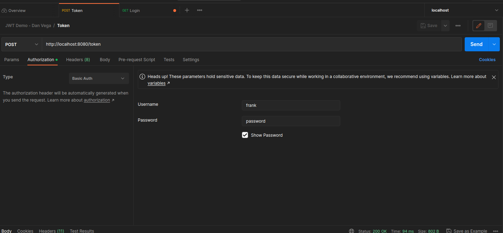
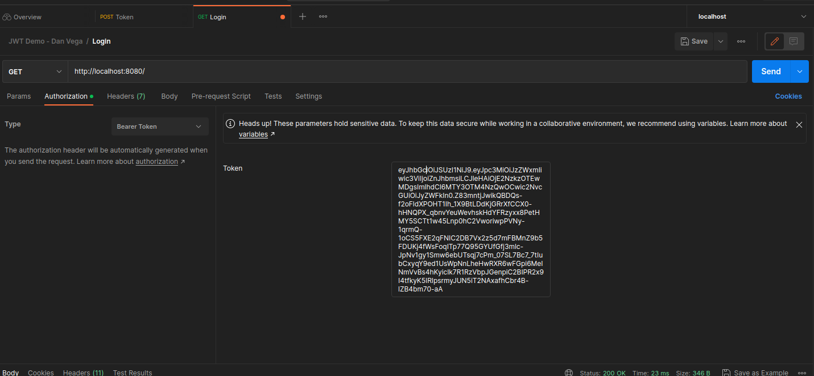

# Requesting the API

## Using CURL

```shell
curl -X POST http://localhost:8080/token -v --user "frank:password"

curl -X GET http://localhost:8080/ -v -H "Authorization: Bearer <token>"
```

## Using Postman





